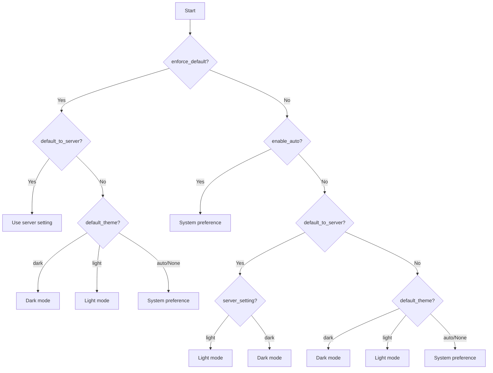

# ThemeToggle Component Initial State Matrix

| enforce_default | default_to_server | enable_auto | default_theme | server_setting | Result              |
|-----------------|-------------------|-------------|---------------|----------------|---------------------|
| True            | True              | True/False  | *             | light          | Light mode          |
| True            | True              | True/False  | *             | dark           | Dark mode           |
| True            | False             | True/False  | "dark"        | light/dark     | Dark mode           |
| True            | False             | True/False  | "light"       | light/dark     | Light mode          |
| True            | False             | True/False  | "auto"/None   | light/dark     | System preference   |
| False           | True              | True        | *             | light          | System preference   |
| False           | True              | True        | *             | dark           | System preference   |
| False           | True              | False       | "dark"        | light          | Light mode          |
| False           | True              | False       | "dark"        | dark           | Dark mode           |
| False           | True              | False       | "light"       | light          | Light mode          |
| False           | True              | False       | "light"       | dark           | Dark mode           |
| False           | True              | False       | "auto"/None   | light          | Light mode          |
| False           | True              | False       | "auto"/None   | dark           | Dark mode           |
| False           | False             | True        | *             | light/dark     | System preference   |
| False           | False             | False       | "dark"        | light/dark     | Dark mode           |
| False           | False             | False       | "light"       | light/dark     | Light mode          |
| False           | False             | False       | "auto"/None   | light/dark     | System preference   |

## UI Behavior:
- When enable_auto = True: Toggle cycles through Dark → Light → Auto
- When enable_auto = False: Toggle cycles through Dark → Light only

